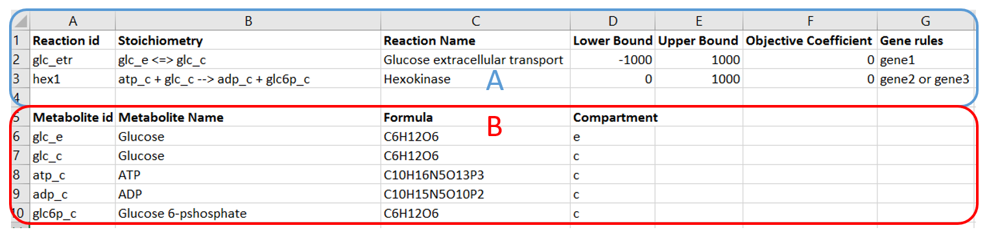
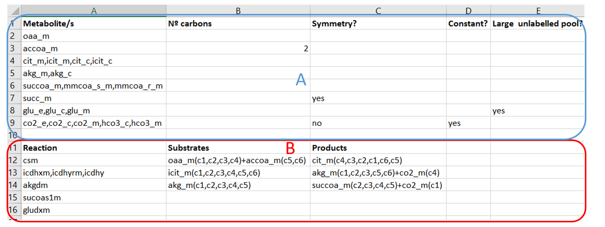
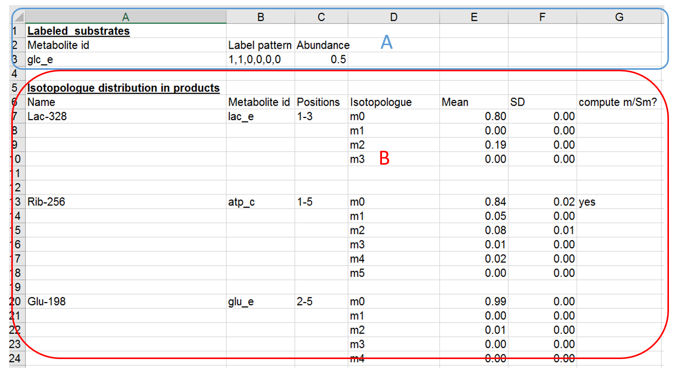
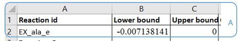

# Iso2flux 
Version: 0.7.2
## Short Description

Iso2flux is an open source software for performing 13C Metabolic Flux Analysis (13CMFA) and  Parsimonious 13C Metabolic Flux Analysis (p13C MFA) 

## Contents
   * [Installation](#Installation)
   * [Scripts](#Scripts)
      * [create_iso2flux_model.py](#create_iso2flux_model.py)
      * [solve_iso2flux_label.py](#solve_iso2flux_label.py)
      * [integrate_gene_expression.py](#integrate_gene_expression.py)
      * [p13cmfa.py](#p13cmfa.py)
      * [get_intervals.py](#get_intervals.py)
   * [Inputs formats](#Inputsformats)
      * [Constraint Based model file](#ConstraintBasedmodelfile)
      * [Label propagation rules](#Thelabelpropagationrules)
      * [Experimental data file](#Experimentaldatafile)
      * [Constraints file](#Constraintsfile)
      * [Gene expression file](#genefile)
      

## Installation
Iso2flux requires the following python packages available from PyPI - the Python Package Index:
 * Cython
 * python-libsbml
 * openpyxl
 * numpy
 * scipy
 * lxml
 * cobra
 * pygmo

Iso2Flux can be installed by running the steup.py script. 

## Scripts
The iso2flux installation includes several command lines scripts that are used to run iso2flux.

### create_iso2flux_model.py

This script creates a iso2flux 13C propagation model object. This object is used as input for the other scripts.It takes the following command line arguments:

--experimental_data_file=, -e (Mandatory): Path to the file describing the labelled substrates used and the quantified isotopologue fractions in metabolic products. .

--label_propagation_rules=,-l (Mandatory) : Path to the file describing the label propagation rules. 

--constraint_based_model=,-c (Mandatory) Path to the constraint based model that will be used in the analysis. 

--flux_constraints=,-f (Optional):Path the file defining additional constraints  for the  constraint_based_model. 

--max_reversible_turnover=,-t (Optional) :  Maximum reversible reaction turnover allowed. Reversible reaction turnover is defined as the flux that is common to the forward (Jf) and reverse (Jr) reactions in a reversible reaction. Default is 20.

--output_prefix=,-o (Optional): Used to define a prefix that will be added to all output files. It can be used both to name the outputs and to select the directory where the outputs will be saved (directory must already exist). If left empty the name of the experimental_data_file will be used. 

--eqn_dir=,-q (Optional): Used to define the directory where iso2flux equations will be saved.

 -v,--validate (Optional): If this flag is used iso2flux will validate if the label propagation rules are properly coupled to the constraint based model. If validation fails it is usually a sign that there is an error in the label propagation rules file.  This mode will not create normal iso2flux inputs. To create a iso2flux model run the script without this flag. 
 
The main outputs (when not run with the -v flag) will be an iso2flux model (.iso2flux) file and a set of files associated to it.  As a general rule, the files generated should not be manually edited or altered. The exception is the flux_penalty.csv file which can be used to set the flux minimization weights used by the p13cmfa script. 

### solve_iso2flux_label.py 
This script will run standard 13C MFA on a iso2flux model and provide the optimal flux distribution. Iso2flux uses the PyGMO generalized island-model. Under this model there are several “islands” (each running on a processor thread) and on each island, there is a population of solutions vectors evolves. After a n number of generations, the best solutions migrate across islands. Some of the parameters of the script are used to define the characteristics this island-model. The parameters that can be taken by the script are:

--iso2flux_model_file=,-I (mandatory):  path to the iso2flux model that will be solved. Iso2flux model can be created with the create_iso2flux_model.py and has  “.iso2flux” as extension. 

--output_prefix=","-o= (optional): Used to define a prefix that will be added to all output files. It can be used both to name the outputs and to select the directory where the outputs will be saved (directory must already exist)

--number_of_processes=,-n(optional): Number of islands (processes) that will be used in the optimization. Should not be larger than the number of processor threads. Default is 4.  

--population_size=(optional),-p(optional):  Size of the population in each island. Default is 20.

--generations_per_cycle=,-g(optional):  Number of generations that each island will evolve before exchanging individuals with other islands. Default is 200.

--max_cycles_without_improvement=,-m (optional): Maximum number of cycles without a significant improvement of the objective function. When this number is reached the algorithm will stop. Default is 9 

### integrate_gene_expression.py
This script uses gene expression data to set add additional minimization weights to reactions with gene expression bellow a given threshold. 

--iso2flux_model_file=,-i (mandatory):  path to the iso2flux model that will be solved. Iso2flux model can be created with the create_iso2flux_model.py and has  “.iso2flux” as extension. 

--gene_expression_file=,-g(optional): path to the file with gene expression data. 

--output_flux_penalty_file=,-o(optional): Used to define a prefix that will be added to the output flux penalty file. It can be used both to name the output and to select the directory where the output will be saved (directory must already exist)

--reference_flux_penalty_file=,-f(optional): path to the reference flux_penalty_file, gene expression penalties will use the values defined in this file as a starting point. Default is the default reference_flux_penalty_file associated to the iso2flux_model loaded.   

--gene_prefix==,-p (optional): prefix of that the constraint based model uses for genes (e.g gene_) that is not present in the gene_expression_file. Default is empty (no prefix )  

--gene_sufix==,-s (optional): suffix of that the constraint based model uses for genes (_at) that is not present in the gene_expression_file. Default is empty (no suffix )  

--remove_penalty_for_spontaneous,-r (Optional): If this flag is set the penalty for reactions not associated to a gene will be 0 

### p13cmfa.py
--iso2flux_model_file=,-I (mandatory):  path to the iso2flux model where p13cmfa will be applied. Generally, the selected Iso2flux model should be the one generated by the solve_iso2flux_label.py script to use the 13CMFA solution as starting point. 

--output_prefix=","-o= (optional): Used to define a prefix that will be added to all output files. It can be used both to name the outputs and to select the directory where the outputs will be saved (directory must already exist)

--number_of_processes=,-n(optional): Number of islands (processes) that will be used in the optimization. Should not be larger than the number of processor threads. Default is 4.  

--population_size=(optional),-p(optional):  Size of the population in each island. Default is 20. 

--generations_per_cycle=,-g(optional):  Number of generations that each island will evolve before exchanging individuals with other islands. Default is 200.

--max_cycles_without_improvement=,-m (optional): Maximum number of cycles without a significant improvement of the objective function. When this number is reached the algorithm will stop. Default is 9 

--flux_penalty_file=,-f (optional): path to the flux_penalty_file, this file defines the weight given to the minimization of each flux. 

--absolute, -a (optional) If this flag is used the tolerance will be used as an absolute tolerance

--tolerance_of_label_objective=,-t(optional): Tolerance of the primary  13C MFA objective in the p13cmfa optimization. If the absolute flag is not used the maximum primary objective allowed value will be the optimal value of the primary objective plus the tolerance_of_label_objective. The optimal value of the primary objective will be taken from the iso2flux_model_file if solve_iso2flux_label.py  has been run with this model. Alternatively, 13C MFA will be run to find the optimal value of the primary objective. If the absolute flag is used, the tolerance_of_label_objective will be the absolute maximum value allowed for the primary objective. Default is 3.84

--starting_flux_value,-s (optional): Initial estimation of the minimal flux value, the script will only sample solutions bellow or equal this value. Default is 1e6 

--cycles=,-c (optional): number of iterations that the script should be run. In complex models the script might not be able to find the absolute minimum in just one iteration, running several iterations increases the likelihood that the absolute minimum has been found.

### get_intervals.py
This script works similar to the p13cmfa.py script but instead of minimizing fluxes it minimizes and maximizes each flux individually to estimate the variation interval for each flux. 
--iso2flux_model_file=,-I (mandatory):  path to the iso2flux model. 

--output_prefix=","-o= (optional): Used to define a prefix that will be added to all output files. It can be used both to name the outputs and to select the directory where the outputs will be saved (directory must already exist)

--number_of_processes=,-n(optional): Number of islands (processes) that will be used in the optimization. Should not be larger than the number of processor threads. Default is 4.  

--population_size=(optional),-p(optional):  Size of the population in each island. Default is 20. 

--generations_per_cycle=,-g(optional):  Number of generations that each island will evolve before exchanging individuals with other islands. Default is 200.

--max_cycles_without_improvement=,-m (optional): Maximum number of cycles without a significant improvement of the objective function. When this number is reached the algorithm will stop. Default is 9 

--absolute, -a (optional) If this flag is used the tolerance will be used as an absolute tolerance

 --tolerance_of_label_objective=,-t(optional): Tolerance of the primary  13C MFA objective in the interval estimation. If the absolute flag is not used the maximum primary objective allowed value will be the optimal value of the primary objective plus the tolerance_of_label_objective. The optimal value of the primary objective will be taken from the iso2flux_model_file if solve_iso2flux_label.py  has been run with this model. Alternatively, 13C MFA will be run to find the optimal value of the primary objective. If the absolute flag is used, the tolerance_of_label_objective will be the absolute maximum value allowed for the primary objective. Default is 3.84
 
# Inputs formats
 
## Constraint Based model file
 A CBM that provides the complete metabolic network stoichiometry, the default flux bounds and the gene-protein-reaction association used to integrate gene expression data. The CBM will be used to compute valid steady state flux distributions. The CBM can be entered either as a SBML file or as a CSV o XLSX file. An example of the information that should be included in CSV or XLSX file is provided bellow. 
 
 * A: Reactions (Mandatory): Describes the reactions of the CBM
o	Reaction ID (Mandatory): ID that will be given to the reaction. ID must be unique to a given reaction
o	Stoichiometry (Mandatory): Stoichiometry of the reaction
o	Reaction Name (Optional): Name of the reaction
o	Lower Bound (Optional): Minimal value of the flux through the reaction
o	Upper bound (Optional): Maximal value of the flux through the reaction
o	Gene rules: Indicates the genes associated to each reaction following the standard gene protein reaction (GPR) notation. 
 * B: Metabolites (Optional): Describes the metabolites in the CBM. If they are not defined they will be automatically identified from the reaction stoichiometry.
o	Metabolite ID: ID of the metabolite, must appear at least once in the stoichiometry of one the reactions defined. 
o	Metabolite Name: Name of the metabolite
o	Metabolite Formula: Empirical formula of the metabolite
o	Compartment: Cellular compartment where the metabolite is found

## Label propagation rules

A XLSX or CSV file that defines how label is propagated in the model. It contains 2 type of information, metabolites where label can propagate and its attributes and reactions that propagate label and its attributes. An example indicating the different options is provided bellow

A Metabolites where label is propagated: Contains the following information:
 * Metabolite/s: ID(s) of the metabolites that can propagate label. Should be the same 
 * metabolite IDs used in the CBM. When several IDs are entered separated by a coma it indicates that these metabolites should be grouped into a single label pool
 * Nº Carbons: Number of positions that can contain labelled atoms. If left empty it will automatically get the number of carbons from the empirical formula defined in the CBM. In the example above, the field has been filled for acetyl CoA (accoa_m) because the number of carbon atoms in the formula (23) is different from the number of carbons when we assume label can propagate (2)
 * Symmetry: Use Yes to indicate that the metabolite/s are symmetric like it is the case with succinate. If left empty it will assume the molecule is not symmetric 
 * Constant: Use Yes to indicate that the abundances of isotopologues for these metabolite should be constant. Constant isotopologues will always have their initial abundances.  In the example above we define that the fractions of isotopologues for carbon dioxide and carbonate pool will be constant and, unless they are defined as labelled in the 13C pattern files, they will always be a 100% m0. If left empty it will be assumed the the isotopologues for this metabolite are not constant. 
 * Large unlabelled pool: At the beginning of a 13C experiment, all internal metabolites are unlabelled (m0). Progressively, these products are enriched in 13C, with the subsequent decrease in m0. Isotopic steady state is quickly reached for small pools of metabolites but not necessarily for larger pools such as those of fatty acids, glycogen and culture medium metabolites. For these larger pools, unlabelled isotopomers m0 are oversized and might not decrease to the hypothetical value that should be reached at steady state. If “Large unlabelled pool” is set to yes Iso2flux will simulate this effect through the addition of a virtual reaction that adds m0 to the metabolite. 

B Reactions that can propagate label. Contains the following information:
 * Reaction ID(s): ID of the reactions that can propagate label. Should be the same reaction IDs used in the CBM. If several reactions IDs are listed separated by coma it will group, the reactions as described in methods. In the example above we wish to group  all the isocitrate dehydrogenase enzymes (icdhxm, icdhyrm and icdhy) because from a label propagation perspective they all are equivalent. Reactions that do not shift carbon positions do not need to be defined as they will be automatically added by Iso2flux. 
 * Substrates and Products: This should indicate how label is propagating by the reaction. For substrates the substrates ID should be written followed by the identification given to the atoms of the substrate that can be labelled (in order). Products should indicate the ID of the products of the reaction followed by the identification of the atoms of the substrates that form the product (in order).  Any identification for atoms can be used provide they are consistent between substrates and products and they are not repeated within the same reaction. When the substrates and products are part of a metabolite group the ID of any member of the group can be used. If the field substrates and products are left empty it will be assumed that the reaction does not alter the position of the labelled atoms between the substrate and product like is the case of glutamate dehydrogenase (gludxm) in the example above. Input and Output reactions do not need to be defined since they will be automatically added by Iso2Flux. 
Iso2Flux is programmed to recognize whether a given row contains information about metabolites (A) or reactions (B) or neither. 
 
## Experimental data file 
One or more XLSX or CSV file that defines the labelled substrates used and the quantified isotopologues. Below is an example of the information that the file should contain. 

A Labelled substrates used and its abundance. Contains the following information:
 * Metabolite ID, ID of the labelled substrates, must be the same used in the CBM
 * Label pattern, indicates of the positions of the metabolite that contain a heavy isotope. 1 denotes heavy isotope (e.g. 13C) and 0 denotes non-heavy isotope (12C). In the example above 1,1,0,0,0,0 indicates we have glucose labelled with 13C in the first two positions. 
 * Abundance, indicates the relative abundance of the labelled substrate (e.g. 0.5 indicates 50% abundance).  
It is not necessary to indicate unlabelled substrates (e.g. in the example above is not necessary to indicate that the abundance of the unlabelled substrate is 0.5)
 
 B Isotopologue distribution in products, contains information about the quantified isotopologues and is abundance. Specifically, the following information:
 * Name of the measurements. This will be used in the output and to refer the measurements.
 * Metabolite id. Id of the metabolite has been measured, must be the ID used in the CBM. If the measurement correspond to multiple metabolites they should be grouped in the label propagation rules and any of the metabolites ID grouped indicated in this field.  
 * Positions measured:  Starting and end position of the fragment that has been measured. In the case of Glu-198, 2-5 indicates that we have measured isotopologues in the a fragment that contains only carbons 2 to 5. 
 * Isotopologue: Indicates the number of heavy isotopes present in each isotopologue (i.e m0:0, m1:1, m2:2 etc …) 
 * Mean: Arithmetic mean of the relative abundance of each isotopologues in the replicates. 
 * SD: Standard deviation of the measurements of relative abundance in a isotopologue 
 * m/Sm: Use Yes to indicate that you wish Iso2Flux to work with the relative abundance of labelled isotopologues.  

The fields Name of the measurements, Metabolite id, Positions measured and m/SM only need to be entered in the first row of each quantified fragment.  

## Constraints file:
A XLSX or CSV file that defines constraints for the CBM

A: When a reaction ID is found on the first column the second column will define the lower bound of the reaction, the third column the upper bound of the reaction and the fourth column the objective coefficient (if its positive the flux will be maximized and if its negative the flux will be minimized).

## Gene expression file:
A XLSX or CSV file that defines the gene expression. In the first row it should have the gene identifiers and the second column the gene expression value. It is important that the type of identifier used in the file is the same as the one used in the CBM model. 
